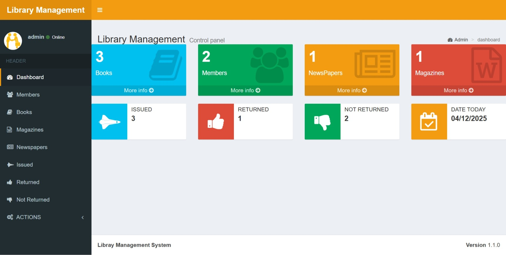

# 📚 Library Management System

A simple yet powerful web-based Library Management System developed using **PHP** and **MySQL**. It enables efficient management of books, magazines, newspapers, and members, along with tracking issued, returned, and overdue items.



## 🔧 Features

- 📘 **Books Management**
- 📰 **Magazines & Newspapers Tracking**
- 👥 **Member Registration & Management**
- 🚀 **Issue & Return Records**
- ⏳ **Track Overdue Items**
- 📊 **Dashboard Overview**

## 📂 Project Structure

```
/Online-Library-Management-System
│
├── /dist/                 # CSS, JS, Images
├── /database/             # Configuration files (DB connection, etc.)
├── main.php               # Main dashboard
├── index.php              # Entry point / login screen
└── README.md              # Project overview
```

## 💻 Technologies Used

- PHP (Core logic)
- MySQL (Database)
- HTML5, CSS3, JavaScript (Frontend)
- Bootstrap (UI Design)

## 🛠️ Installation & Setup

1. **Clone the Repository**
   ```bash
   git clone https://github.com/got-sanjay/Online-Library-Management-System.git
   cd library-management
   ```

2. **Set Up Database**
   - Import the `/database/saide_db.sql` file into your MySQL server.
   - Update your database credentials in `config.php` (or wherever your DB config is).

3. **Run the Project**
   - Place the project folder inside `htdocs` (for XAMPP) or your local web server root.
   - Start Apache and MySQL via XAMPP.
   - Visit `http://localhost/Online-Library-Management-System` in your browser.

4. **Default Login**
   ```
   Username: admin
   Password: admin
   ```

## 📸 Screenshots

| Dashboard View | Manage Books | Issue/Return |
|----------------|--------------|--------------|
|  |

## 📌 To-Do / Future Enhancements

- Add Email Notifications for Due Books
- Add Role-Based Access (Admin, Librarian, Member)

> Created with ❤️ by [Sanjaykumar](https://www.linkedin.com/in/gotsanjay)
